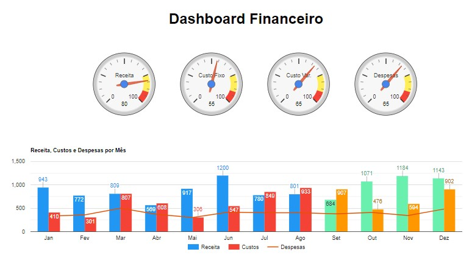
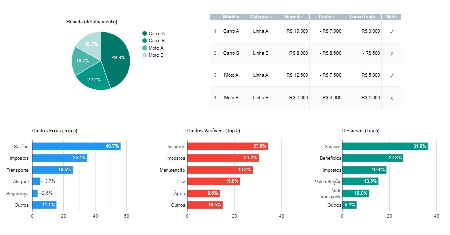

<h1>:bar_chart::chart_with_upwards_trend:Dashboard (em construção)</h1>

Dashboard contruída usando a biblioteca Google Charts Tools.

 
<figure>
    
    
</figure>

<h2>:computer: Como usar</h2>
Para ver no navegador baixe o repositório e abra o arquivo "index.html".

<h2>:memo: Licença</h2>
Distribuído sob a licença MIT. Veja <a href="LICENSE">LICENSE</a> para mais informações.
